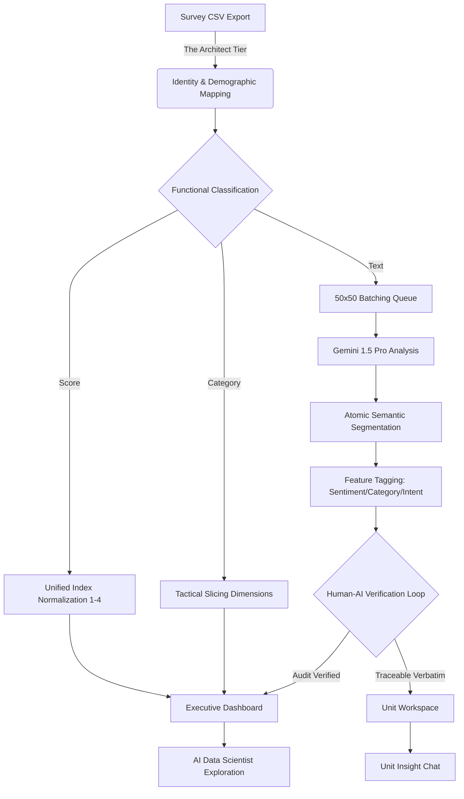

# Research Paper: Transforming Institutional Intelligence through Verifiable AI and Recursive Taxonomy Discovery

## Abstract
Institutional decision-making in higher education has traditionally struggled to effectively synthesize large-scale qualitative student feedback, often falling into the "Crisis of Administrative Intuition" where high-stakes interventions are guided by averages rather than evidence. This paper presents the **Student Voice Platform (SVP)**, a multi-tier AI-driven architecture designed to transform unstructured feedback into a validated, longitudinal, and verifiable evidence base for institutional governance. Central to the SVP are three primary architectural innovations: **Recursive Taxonomy Discovery**, which utilizes a feedback loop between static mandatory seeding and iterative semantic exploration to evolve unit-specific metrics; **Atomic Semantic Segmentation**, an orchestrated batch-processing engine that deconstructs complex respondent voices into discrete, tagged idea-segments; and **Traceable Trust**, a 'Human-in-the-Loop' verification state-machine that mandates accountability through atomic evidence traceability and human-gated workflow. By integrating these layers with a conversational **AI Data Scientist** and multi-level tactical-strategic dashboards, the SVP enables a paradigm shift from reactive sentiment tracking to proactive **Intervention Harvesting**. This provide a scalable architectural blueprint for "Institutional Intelligence," ensuring that student-centric stewardship in the modern university is grounded in verified, longitudinal evidence.

**Keywords**: *Institutional Intelligence, Student Voice, Verifiable AI, Sentiment Normalization, Automated Taxonomy Discovery, Higher Education Governance, Human-in-the-Loop.*

## 1. Introduction: The Crisis of Administrative Intuition
In the modern landscape of higher education, institutional decision-making has historically pivoted between two suboptimal poles: the reductionist simplicity of quantitative metrics and the unscalable complexity of qualitative feedback. Traditional Student Satisfaction Indexes (SSI) typically rely on Likert-scale instruments that, while computationally convenient, often flatten the nuanced reality of student experiences into a single numerical average. This reliance on "mean scores" often obscures localized crises; a healthy institutional average can easily mask severe operational failures within a single, critical student-facing unit.

Furthermore, in the digital age, student expectations have evolved. Students no longer view their university experience as a monolith; rather, they perceive it as a series of interconnected services—ranging from digital portals and academic advising to physical facilities and nomadic learning spaces. This fragmentation of the student experience is mirrored in the fragmentation of the data institutions collect. While qualitative comments contain the "ground truth" of these interactions, the sheer volume of such data—often reaching tens of thousands of entries per survey cycle—renders manual thematic analysis prohibitively expensive and prone to subjective bias.

This conceptual and operational gap results in what we term the "Crisis of Administrative Intuition." In this state, university leaders are forced to make high-stakes strategic interventions based on directional "gut feelings" or anecdotal evidence rather than granular, verifiable data. When a satisfaction score drops in a specific department, the quantitative data can signal *that* there is a problem, but it rarely explains the *causality*—whether the issue is rooted in staff attitude, facility inadequacy, or inter-departmental friction. Without a scalable way to bridge this gap, institutions risk misallocating limited resources on interventions that address symptoms rather than root causes.

This paper introduces the **Student Voice Platform (SVP)**, a comprehensive AI-driven architecture designed to bridge this divide. The SVP does not merely summarize text; it constructs a multi-layered semantic pipeline that transforms raw respondent data into a structured, longitudinal institutional knowledge base. By integrating **Recursive Taxonomy Discovery**, **Atomic Semantic Segmentation**, and a rigorous **Traceable Trust (Human-in-the-Loop)** verification layer, the platform enables a new paradigm of "Institutional Intelligence." This shift allows administrators to transition from reactive administrative intuition to proactive, evidence-based governance, where every AI-generated insight is tethered to the original, verifiable voice of the student.

## 2. Methodology: The Multi-Tier Semantic Pipeline
The Student Voice Platform architecture utilizes a distributed, multi-strata processing model to handle the high-entropy transition from raw survey exports to validated institutional intelligence. This process is orchestrated through three distinct technical layers:

### 2.1 The Multi-Tier Semantic Pipeline: Architectural Flow
To visualize the transformation from raw data to institutional intelligence, the following diagram illustrates the SVP's orchestrated pipeline:

### 2.2 Ingestion and Intelligence Mapping (The Architect Tier)
The challenge of institutional data often lies in its lack of standardized schema across different departments or survey cycles. The SVP's ingestion layer employs a dual-stage AI classification protocol:
1.  **Identity/Demographic Mapping**: An LLM-driven agent (built on the Gemini 1.5 Pro architecture) scans CSV headers to identify demographic anchors—specifically `Faculty`, `Major`, `Year of Study`, and `Primary Location`. This mapping is not merely a keyword match; the AI evaluates the semantic context of headers to ensure that disparate naming conventions (e.g., "Department" vs. "Academic Unit") are normalized into a consistent demographic graph.
2.  **Functional Column Architect**: Every data column is classified into three functional types via a zero-shot classification chain:
    -   **SCORE**: Quantitative inputs requiring numerical normalization.
    -   **CATEGORY**: Low-cardinality values used for data slicing and cross-tabulation.
    -   **TEXT**: High-entropy qualitative feedback requiring semantic segmentation.
    This classification determines the **Analysis Blueprint**—a metadata object that instructs downstream services on how to process each specific column.

### 2.2 Numerical Indexing and Likert Normalization
To ensure university-wide benchmarking, the platform addresses the "Normalization Problem"—where disparate survey instruments use diverse scoring ranges.
-   **The Unified Index Protocol**: All quantitative inputs (Likert 1-5, 1-10, or Boolean 0-1) are translated into a standardized **1.0 - 4.0 Index**. A score of 4.0 represents absolute satisfaction, while 1.0 represents a critical service failure.
-   **Dynamic Likert Mapping**: The AI identifies the scale of the source data by sampling respondent values. It then generates a "Translation Map" (e.g., in a 1-5 scale, 5 becomes 4.0, 3 becomes 2.33, and 1 becomes 1.0).
-   **Fuzzy Sentiment Translation**: For Indonesian-specific context, the platform utilizes fuzzy semantic matching to translate qualitative sentiment descriptors. For instance, terms like "Puas" (Satisfied) and "Sangat Puas" (Highly Satisfied) are assigned specific coefficients within the 1-4 scale, ensuring that global institutional averages remain mathematically consistent regardless of the source instrument's qualitative scale.

### 2.3 Orchestrated Analysis Queue (The Semantic Heart)
The processing of high-volume qualitative text is handled via an orchestrated queue designed for rate-limit resilience and semantic granularity.
-   **The 50x50 Batching Protocol**: Qualitative comments are processed in synchronized batches of 50. This batch size was selected after empirical testing to maximize LLM context window efficiency (minimizing duplicate token overhead) while preventing "summarization drift"—where the AI loses individual nuance in favor of a general theme.
-   **Atomic Semantic Segmentation**: Recognizing that a single student comment often addresses multiple disparate issues (e.g., "The professor was excellent, but the classroom Wi-Fi was non-functional"), the analysis engine deconstructs long-form text into **Atomic Idea Segments**. 
-   **Logical Feature Tagging**: Each atomic segment is evaluated for four primary features:
    1.  **Sentiment**: (Positive | Negative | Neutral).
    2.  **Category Mapping**: Assignments matching the unit-specific taxonomy.
    3.  **Intent Detection**: Identification of the `is_suggestion` flag for proactive intervention.
    4.  **Unit-Coupling**: Detection of cross-departmental mentions for relational impact mapping.
Each tagged segment is then stored as a discrete, auditable entry in the `feedback_segments` table, linked permanently to its parent respondent ID.

## 3. Core Innovations
The Student Voice Platform introduces three fundamental innovations that differentiate it from standard sentiment analysis tools and general-purpose LLM summarizers.

### 3.1 Autonomous & Recursive Taxonomy Discovery: Solving the "Cold Start" and "Contextual Bias" Problems
Institutional structures are rarely uniform; the criteria for success in a "Registrar's Office" differ fundamentally from those of a "Faculty of Engineering." Traditional NLP approaches typically fail here by either utilizing a rigid, centralized taxonomy (causing contextual bias) or requiring manual labelling (the "Cold Start" problem). 
The SVP solves this through **Recursive Discovery**:
-   **Static Baseline Seeding**: Every unit begins with a "Mandatory Core" derived from the `MANDATORY_CATEGORIES` constant (e.g., *Service Speed*, *Staff Professionalism*). This ensures that global institutional benchmarks remain mathematically consistent.
-   **Iterative Thematic Evolution**: The discovery engine (`suggest-taxonomy` protocol) analyzes the initial 1000 comments for a specific unit to identify unique emerging themes. It then dynamically proposes a unit-specific taxonomy, which is refined through **Human-Guided Instructions** (`unit_analysis_instructions`). This recursive loop ensures that the analysis is contextually relevant to the unit's operational reality while remaining institutionally aligned.

### 3.2 Dynamic Semantic Tagging and Intent Detection: From Summary to Intervention
Beyond simple sentiment classification (Positive | Negative | Neutral), the SVP’s analysis loop implements a multi-dimensional tagging architecture designed for "Intervention Harvesting."
-   **Proactive Intent Identification**: Every atomic segment is evaluated for the `is_suggestion` flag. This logic distinguishes general complaints (e.g., "The lab is too hot") from proactive student recommendations (e.g., "The university should install climate control in Lab 301"). Isolating these "Atomic Suggestions" allows administrators to move from passive sentiment tracking to active problem-solving.
-   **Cross-Departmental Dependency Mapping**: The AI utilizes a cross-unit relational engine to detect mentions of departments outside the target unit (e.g., a student criticizing "Network Connectivity" within a "Finance Office" survey). By tagging these as `related_unit_name`, the system builds an institutional dependency graph, highlighting how service failures in one unit impact the perception of others.

### 3.3 Traceable Trust: The Architecture of Accountability
The primary barrier to AI adoption in institutional governance is the "Black Box" problem—the risk of machine hallucinations driving high-stakes policy decisions. The SVP addresses this through the **Traceable Trust** architecture:
-   **The Verification State Machine**: Every AI-generated segment and tag resides in a "Provisional" state until it is explicitly processed through the `DataBrowser` interface. Administrators can override sentiment, re-categorize segments, and update suggestions. The `is_verified` flag in the `feedback_segments` table acts as a proof-of-human-audit.
-   **Atomic Accountability**: In the audit interface, every metric is presented in parallel with its original verbatim source. This "Evidence Traceability" ensures that no chart or report exists in a vacuum; every data point is a "double-click" away from the raw student voice.
-   **Workflow Gating**: The platform enforces a staged governance path: *Seeding* → *Recursive Discovery* → *Batch Processing* → *Human Verification* → *Executive Synthesis*. This sequence ensures that by the time data reaches the university's executive level, it has been double-gated by both machine logic and human expertise.

## 4. Institutional Aggregation & Interaction
The utility of semantic intelligence is realized through its multi-tiered presentation layer, which serves diverse stakeholders from unit-level operational leaders to institutional executive boards. This layer is engineered to balance granular visibility with high-level summarization.

### 4.1 Multi-Dimensional Visualization Hubs: Tactical vs. Strategic Intelligence
The SVP architecture separates data visualization into two distinct strategic views to prevent information overload while maintaining granular accountability:
1.  **The Unit Workspace (Tactical Intelligence)**: Every organizational unit (e.g., a specific Faculty or Support Service) is provided with a "Comprehensive Dashboard." This view focuses on the granular performance of the unit’s specific taxonomy.
    -   **Volume-Weighted Sentiment Distribution**: Sentiment is visualized through indexed bars and radar charts (using the normalized 1-4 scale), allowing unit leaders to identify which specific "Atomic Suggestion" categories (e.g., *Digital Infrastructure Reliability*) are driving negative perception.
    -   **Evidence-Based Drill-down**: The interface facilitates a seamless transition from a high-level trend line directly to the student verbatim segments that populate it. This "Infinite Drill-down" ensures that leaders can read the specific comments behind any statistical outlier.
2.  **The Executive Overview (Strategic Stewardship)**: For university leadership, the SVP aggregates metrics into a global "Executive Dashboard." This view prioritizes high-level institutional health through three primary instruments:
    -   **The Comparative Sentiment Heatmap**: A visualization tool that ranks all units by their normalized index. This allows for the rapid identification of systemic excellence (best-performing units) or operational crises (outliers requiring immediate intervention).
    -   **Executive Synthesis Reports**: Using the `generate-report` protocol, the system summarizes qualitative themes across all units into a consolidated executive brief. This report includes automated SWOT analysis (Strengths, Weaknesses, Opportunities, Threats) derived from the verified semantic segments.
    -   **Institutional Gap Analysis**: A comparative view showing the distance between unit performance and universal university-wide benchmarks.

### 4.2 The AI Data Scientist: Conversational Exploration and Dynamic Charting
Beyond static reporting, the platform introduces the **AI Data Scientist**, a conversational interface designed for deep, interactive institutional research without the need for specialized SQL or data science expertise.
-   **High-Volume Dataset Caching**: To ensure sub-second response times for complex queries over thousands of rows, the analyst operates on a pre-processed `ai_dataset_cache`. This cache is an anonymized, mathematically optimized representation of the entire survey population, containing all demographic markers and AI-generated semantic tags.
-   **Conversational Code Generation**: The system utilizes a specialized LLM agent to interpret natural language queries (e.g., "Compare the sentiment of Year-1 students against Year-3 students regarding staff availability in the Faculty of Arts"). The AI then generates dynamic code to produce interactive visualizations via Plotly and Chart.js.
-   **Executive Presence & History**: The system allows for the saving of AI-generated charts directly to the Executive Dashboard, creating a living repository of "Discovered Insights."

### 4.3 Unit-Level Conversational Assistants: Localized Insight Synthesis
Supplementing the global Data Scientist, each unit workspace includes a **Unit Insight Chat**. This assistant differs from the global analyst in its scope and data access:
-   **Unit-Specific Context**: The unit assistant is "clamped" to the data and taxonomy of a single survey unit. This prevents "data bleed" and ensures that the AI’s advice is entirely grounded in the specific feedback related to that unit.
-   **Automated Report Drafting**: Unit leaders can use the chat to draft formal reports or memos (e.g., "Write a summary of the top three negative issues in this unit for my faculty board meeting"). The assistant utilizes the `feedback_segments` and `unit_ai_reports` tables to provide evidence-backed drafting.
-   **Transparency and Verification Paths**: Every claim made by the unit assistant can be verified through a "Show Evidence" link, which points back to the `DataBrowser` to show the exact student comments used to generate the response.

## 5. Governance & Longitudinal Impact: Scaling Institutional Intelligence
For an institutional intelligence platform to be effective, it must scale beyond isolated survey snapshots to provide a longitudinal narrative of institutional progress. The SVP facilitates this through a structured governance framework that balances local flexibility with global institutional oversight.

### 5.1 Institutional Benchmarking through Mandatory Taxonomies
While the platform emphasizes unit-specific discovery, it maintains institutional consistency through the **Mandatory Taxonomy Enforcer**. This mechanism solves the "Benchmarking Paradox"—where units are too diverse to compare fairly, yet the university requires a global performance index.
-   **Baseline Semantic Seeding**: Every unit profile, regardless of its specialized operational focus, is automatically seeded with a set of `MANDATORY_CATEGORIES` (e.g., *Service Speed*, *Staff Professionalism*, and *Information Clarity*). 
-   **Weighted Cross-Unit Comparison**: By enforcing these core categories at the architectural level, the university can generate normalized "University-Wide Benchmarks." This allows executive leadership to compare the relative service performance of disparate units (e.g., comparing the response speed of the "Student Finance Office" against the "Registrar") on a standardized, volume-weighted semantic scale.
-   **Governance Overrides**: The system allows for "Institutional Laws" to be injected via the `unit_analysis_instructions` feature, ensuring that AI analysis remains compliant with evolving university policies or strategic priorities.

### 5.3 Data Privacy and Ethical Anonymization
Institutional feedback requires a rigorous approach to student anonymity to ensure psychological safety and data integrity.
-   **PII Sanitization**: During the "The Architect Tier" phase, the system identifies and flags Potential Identifiable Information (PII) within qualitative columns.
-   **Anonymized Synthesis**: All executive-level reports and AI Data Scientist queries operate on the `ai_dataset_cache`, which utilizes an anonymized representation of the student population, stripping individual respondent IDs while retaining demographic markers for group-level analysis.
-   **Compliance-by-Design**: The logical isolation of surveys ensured by the `survey_id` architecture facilitates adherence to international data protection standards (such as GDPR), allowing for the localized "Right to Erasure" without compromising the integrity of historical institutional benchmarks.

### 5.4 Longitudinal Performance Scaling and Year-over-Year Trajectories
Academic institutions operate in multi-year cycles. The SVP architecture is engineered to trace institutional evolution across these reporting periods without losing historical context.
-   **Survey Isolation & Aggregation Mechanics**: Data is physically and logically isolated by `survey_id` to maintain the integrity of specific reporting periods. However, the **YearComparison Engine** enables administrators to aggregate these snapshots into a continuous temporal graph.
-   **Trend Trajectory Analysis (TTA)**: By mapping the "Unified Index" and semantic tags across multiple years, the platform visualizes performance trajectories. This enables leadership to perform "Impact Assessment" for specific strategic interventions. (Example: "Did the 2024 faculty development program result in a measurable increase in the 'Staff Professionalism' index for the Engineering unit in the 2025 cycle?").
-   **Resilience to Structural Evolution**: Because the platform utilizes AI to re-discover taxonomies per cycle while maintaining core seeds, the institutional benchmarks remain mathematically stable even as a specific unit’s internal structure, staff composition, or student priorities evolve over a five-year reporting window.
-   **Predictive Stewardship**: The accumulation of longitudinal data allows the AI Data Scientist to identify "Early Warning Signals"—recurring negative sentiment patterns that historically precede drops in overall student retention or satisfaction scores.

## 6. Conclusion: Towards Verifiable Institutional Intelligence
The Student Voice Platform represents a fundamental shift in how higher education institutions process, interpret, and act upon student sentiment. By moving beyond the limitations of simple quantitative averages and the unscalability of manual qualitative review, the SVP architecture establishes a new paradigm of **Verifiable Institutional Intelligence**.

The core of this breakthrough lies in the platform’s multi-layered approach to semantic integrity. Through **Recursive Taxonomy Discovery**, the system respects the operational diversity of large universities, ensuring that unit-level insights are contextually accurate rather than administratively generic. By deconstructing student voices into **Atomic Semantic Segments**, the platform captures the granular reality of the student experience, identifying not just *what* students feel, but the specific, actionable suggestions they offer for institutional improvement. This transition from "sentiment tracking" to "intervention harvesting" represents a significant evolution in student-centric governance.

Most critically, the **Traceable Trust** model addresses the ethical and operational risks of "Black Box" AI. In an era where automated decision-making is often met with skepticism, the SVP’s mandatory human-gated verification and persistent evidence traceability ensure that institutional strategy is never dictated by unverified machine summaries. Instead, it is informed by a rigorous synthesis of human oversight and machine efficiency, where every executive decision can be justified by raw student verbatim.

As universities face increasing pressure to demonstrate measurable value, student success, and operational responsiveness, the ability to transform thousands of unstructured student voices into a structured, longitudinal, and verifiable evidence base becomes a strategic necessity. The Student Voice Platform provides more than just a tool; it offers an architectural blueprint for the transition from reactive administrative intuition to a new era of proactive, evidence-based academic stewardship. In doing so, it ensures that the student voice is not just heard, but is systematically and accurately integrated into the very foundation of institutional progress.

## 7. Future Research: The Path to Predictive Stewardship
While the current Student Voice Platform provides a robust descriptive and diagnostic framework, the architecture is engineered to support future evolutions in predictive institutional intelligence.
-   **Predictive Retention Modeling**: Future iterations aim to correlate semantic patterns with student retention data. By identifying "Linguistic Precursors" to student attrition (e.g., changes in sentiment regarding "Academic Support" early in the semester), institutions can move from observation to early intervention.
-   **Multi-Modal Feedback Integration**: The research path includes the integration of diverse feedback streams, such as nomadic facility usage data and digital portal engagement metrics, to create a "360-degree Semantic Twin" of the student experience.
-   **Cross-Institutional Benchmarking**: The expansion of the **Mandatory Taxonomy Enforcer** to a multi-university level could enable the first truly standardized qualitative benchmarking framework for the global higher education sector.
